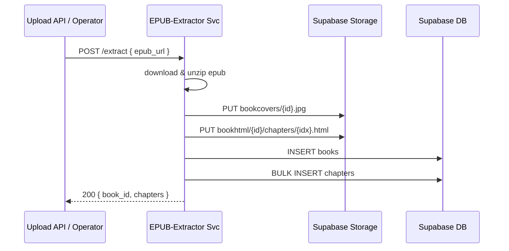

# 📦 EPUB 解析服务交付规格（v0.2 — Node 版本）

> **目标**：用 **Node + Express** 将现有本地 EPUB 解析脚本容器化，部署到已运行 Docker 的 ECS，暴露 HTTP 接口，实现一键解析 ➜ Supabase 数据写入。
>
> **适用读者**：后端工程师 · DevOps。

## 坑/注意事项

- 由于ecs位于国内，网络拉取不了node，用docker images检查已有的镜像发现有node可以直接使用，所以直接用
- 注意清理悬空镜像
- ide使用的是windows电脑，不要自动执行Ubuntu命令，只需要告诉我我手动ssh到ecs上执行

---

## 1  项目背景

* 现有解析脚本基于 **JavaScript**，可解析书名、作者、封面、章节 HTML。
* **ECS 已就绪**（Docker 环境），可直接拉取容器运行，但是我的经验不足，需要引导。
* 需求：打包为轻量镜像 + 简易 HTTP 接口供内部调用。

---

## 2  总体流程



---

## 3  接口规格

| Verb   | Path       | Body                                                         | 说明                              |
| ------ | ---------- | ------------------------------------------------------------ | ------------------------------- |
| `POST` | `/extract` | `{ "epub_url": "https://.../foo.epub", "book_id?": "uuid" }` | 幂等；`book_id` 缺省则生成 UUID         |
| `GET`  | `/health`  | –                                                            | `200 OK` → `{ "status": "up" }` |

**成功响应示例**

```jsonc
{
  "book_id": "4d5c…",
  "chapters": 12,
  "cover_url": "https://.../bookcovers/4d5c.jpg"
}
```

错误码：400 参数错 · 409 已存在 · 500 服务异常。

---

## 4  技术栈 & 依赖

| 分层           | 选择                                | 主要包                              |
| ------------ | --------------------------------- | -------------------------------- |
| HTTP 框架      | **Express 4**                     | `express`                        |
| EPUB 解析      | `epub-parser` + `node-stream-zip` | `epub-parser`, `node-stream-zip` |
| Supabase SDK | 官方 JS                             | `@supabase/supabase-js` v2       |
| 其他           | 文件处理                              | `mime`, `uuid`, `axios`          |

---

## 5  Docker 打包

```Dockerfile
FROM node:20-slim

# 安装依赖
WORKDIR /app
COPY package*.json ./
RUN npm ci --omit=dev

# 拷贝源代码
COPY . .

ENV PORT=8080  \
    SUPABASE_URL=  \
    SUPABASE_SERVICE_KEY=

EXPOSE 8080
CMD ["node", "server.js"]
```

> 体积 ≈ 80 MB；启动即监听 `0.0.0.0:8080`。

---

## 6  关键代码片段（简要）

```js
// server.js
import express from 'express';
import { createClient } from '@supabase/supabase-js';
import { parseEpub } from './parser.js';

const app = express();
app.use(express.json());

const supa = createClient(process.env.SUPABASE_URL, process.env.SUPABASE_SERVICE_KEY);

app.post('/extract', async (req, res) => {
  const { epub_url, book_id } = req.body;
  if (!epub_url) return res.status(400).json({ error: 'epub_url required' });
  try {
    const result = await parseEpub(epub_url, book_id, supa);
    return res.json(result);
  } catch (e) {
    console.error(e);
    return res.status(500).json({ error: e.message });
  }
});

app.get('/health', (_, res) => res.json({ status: 'up' }));

app.listen(process.env.PORT || 8080, () => console.log('EPUB extractor up'));
```

---

## 7  环境变量

| 变量                     | 说明                                |
| ---------------------- | --------------------------------- |
| `SUPABASE_URL`         | 项目 URL                            |
| `SUPABASE_SERVICE_KEY` | Service Key（写权限）                  |
| `BUCKET_HTML`          | 默认 `bookhtml`                     |
| `BUCKET_COVER`         | 默认 `bookcovers`                   |
| `PUBLIC_BUCKET`        | `true` / `false` → 决定返回公开还是签名 URL |

---

## 8  部署示例

```bash
docker run -d --name epub-extractor -p 8080:8080 \
  -e SUPABASE_URL=... \
  -e SUPABASE_SERVICE_KEY=... \
  -e BUCKET_HTML=bookhtml \
  -e BUCKET_COVER=bookcovers \
  --restart unless-stopped \
  your-registry/epub-extractor:latest
```

* 端口：8080（内网）。
* 资源：0.5 vCPU / 512 MB。
* 日志：stdout/stderr → 集中到 Loki。

---

## 9  错误与重试

| 场景                 | 行为  | 重试                  |
| ------------------ | --- | ------------------- |
| 下载 EPUB 失败         | 500 | 调用方重试 3 次，间隔 10 s   |
| Supabase 写 DB 外键冲突 | 409 | 记录 `error_log`，人工处理 |
| Storage 上传 4xx     | 502 | 自动重试；三次失败报警 Slack   |

---

## 10  安全

快速迭代阶段，只做 **HTTP 明文内部调用**，无额外鉴权。生产前再加 JWT 或 VPC ACL。

---

## 11  Supabase `books` 表结构（参考）

| 列名             | 类型          | 说明         |
| -------------- | ----------- | ---------- |
| `id`           | `uuid` PK   | 书籍主键       |
| `title`        | `text`      | 书名         |
| `author`       | `text`      | 作者         |
| `language`     | `char(2)`   | ISO‑639‑1  |
| `epub_url`     | `text`      | 源地址        |
| `cover_url`    | `text`      | CDN URL    |
| `cover_base64` | `text`      | 备用封面       |
| `tags`         | `jsonb`     | `[]` 默认    |
| `created_at`   | `timestamp` | 默认 `now()` |

外键：`chapters.book_id` → `books.id ON DELETE CASCADE`。

---

## 12  CI/CD（极简）

沿用之前 **GitHub Actions + SSH** 流水线，只需将 `docker build` 基础镜像改为 `node:20-slim`，启动命令改为 `node server.js`，其他步骤不变。

---

## 13  交付物

| 路径                                   | 内容                              |
| ------------------------------------ | ------------------------------- |
| `/src/`                              | `server.js`, `parser.js`, utils |
| `package.json` / `package-lock.json` | 依赖锁定                            |
| `Dockerfile`                         | 见 §5                            |
| `README.md`                          | 使用说明                            |
| `.github/workflows/docker.yml`       | CI/CD                           |
