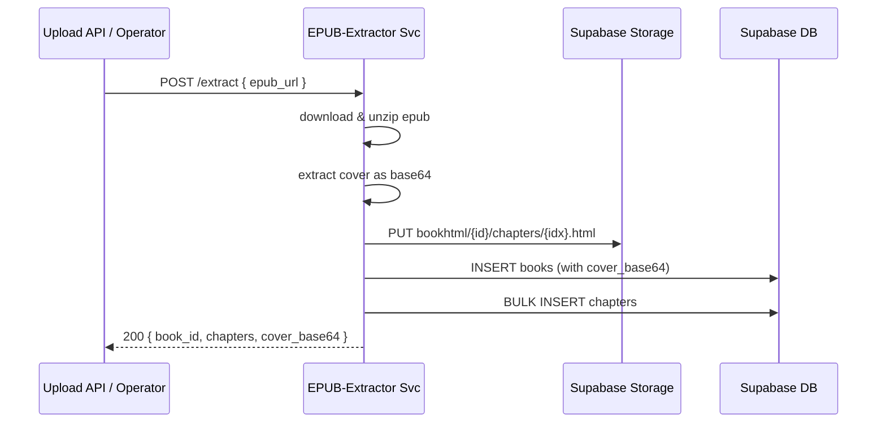

# 📦 EPUB 解析服务交付规格（v0.3 — Node 版本）

> **目标**：用 **Node + Express** 将现有本地 EPUB 解析脚本容器化，部署到已运行 Docker 的 ECS，暴露 HTTP 接口，实现一键解析 ➜ Supabase 数据写入。
>
> **适用读者**：后端工程师 · DevOps。

---

## 1 项目背景

* 现有解析脚本基于 **JavaScript**，可解析书名、作者、封面、章节 HTML。
* **ECS 已就绪**（Docker 环境），可直接拉取容器运行。
* 需求：打包为轻量镜像 + 简易 HTTP 接口供内部调用。
* **重要变更**：
  - `book_id` 现在由 Supabase 数据库自动生成
  - 封面图片直接提取为 Base64 编码存储在数据库
  - 新增 EPUB 文件列表接口

---

## 2 总体流程



---

## 3 API 接口规格

### 健康检查
```http
GET /health
```

**响应**:
```json
{
  "status": "up",
  "timestamp": "2024-01-01T00:00:00.000Z"
}
```

### 列出 EPUB 文件
```http
GET /epubs
```

**响应**:
```json
{
  "files": [
    {
      "name": "example.epub",
      "size": 1024000,
      "created_at": "2024-01-01T00:00:00.000Z",
      "updated_at": "2024-01-01T00:00:00.000Z",
      "url": "https://your-project.supabase.co/storage/v1/object/public/bookepub/example.epub"
    }
  ],
  "total": 1
}
```

### EPUB 解析
```http
POST /extract
Content-Type: application/json

{
  "epub_url": "https://example.com/book.epub"
}
```

**响应**:
```json
{
  "book_id": 123,
  "title": "Book Title",
  "author": "Author Name",
  "chapters": 15,
  "cover_base64": "data:image/jpeg;base64,/9j/4AAQSkZJRgABAQAAAQ...",
  "chapter_urls": [
    "https://your-project.supabase.co/storage/v1/object/public/bookhtml/123/chapter_1.html"
  ],
  "message": "EPUB parsed and uploaded successfully"
}
```

**错误码**：400 参数错 · 409 已存在 · 500 服务异常。

### 环境变量要求

```env
# Supabase 配置
SUPABASE_URL=your_supabase_url
SUPABASE_SERVICE_KEY=your_service_key
SUPABASE_STORAGE_BUCKET=bookepub

# 服务配置
PORT=8082
NODE_ENV=production

# 存储桶配置
BUCKET_HTML=bookhtml
BUCKET_COVER=bookcover  # 不再使用，但保留兼容性
PUBLIC_BUCKET=public

# 可选配置
DOWNLOAD_TIMEOUT=30000
MAX_FILE_SIZE=50MB
```

### 数据库 Schema

```sql
CREATE TABLE books (
  id BIGSERIAL PRIMARY KEY,  -- 或使用 UUID 类型
  title VARCHAR(255) NOT NULL,
  author VARCHAR(255),
  description TEXT,
  language VARCHAR(10) DEFAULT 'en',
  publisher VARCHAR(255),
  published_date DATE,
  cover_base64 TEXT,  -- Base64 编码的封面图片
  created_at TIMESTAMP WITH TIME ZONE DEFAULT NOW(),
  updated_at TIMESTAMP WITH TIME ZONE DEFAULT NOW()
);
```

### 快速测试命令

```bash
# 健康检查
curl http://localhost:8082/health

# 列出 EPUB 文件
curl http://localhost:8082/epubs

# 解析 EPUB
curl -X POST http://localhost:8082/extract \
  -H "Content-Type: application/json" \
  -d '{"epub_url": "https://www.gutenberg.org/ebooks/74.epub.noimages"}'
```

---

## 4 安全

快速迭代阶段，只做 **HTTP 明文内部调用**，无额外鉴权。生产前再加 JWT 或 VPC ACL。

### 部署注意事项


1. 确保数据库 `books` 表已更新为支持自动生成 ID
2. 确保 `SUPABASE_STORAGE_BUCKET` 环境变量已正确配置
3. 如果使用现有数据，可能需要数据迁移脚本来处理 `cover_url` 到 `cover_base64` 的转换
4. 更新前端代码以使用新的 API 响应结构
5. 使用提供的 Postman 测试集 `postman_collection_updated.json` 进行 API 测试
