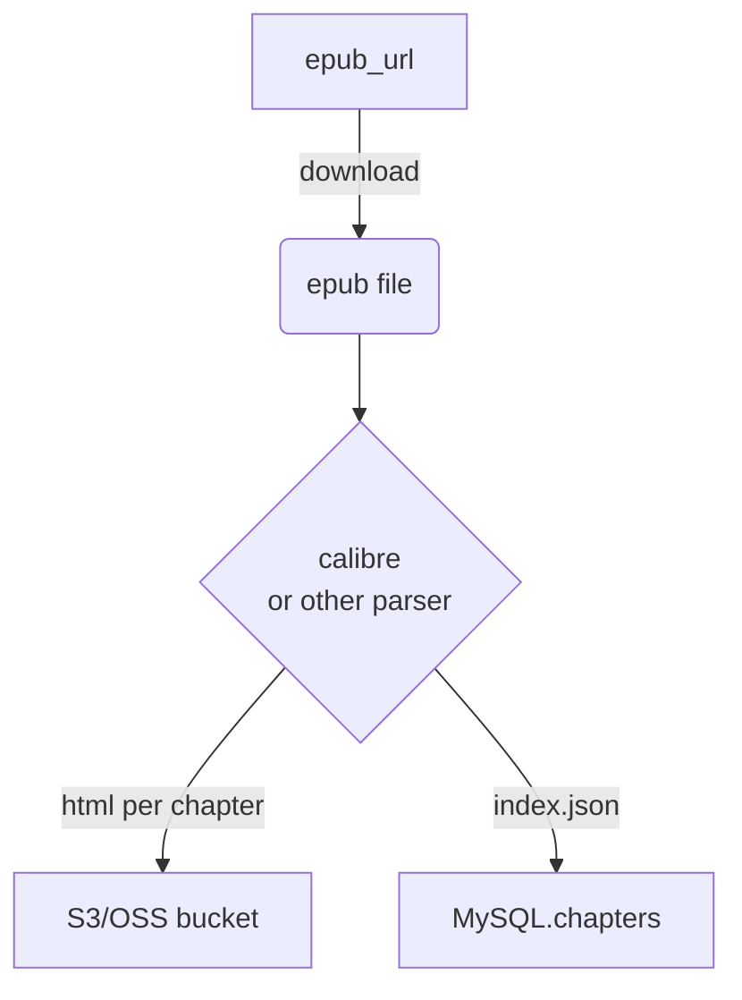

# 渲染书籍方案/架构设计

### 先把最大的误区说清楚

> **“不用 epub.js == 必须把正文塞进 MySQL”** —— 这是假命题。
> **正文根本不该放在事务型数据库里**。那会让你：
>
> 1. **备份/迁移巨慢**（几十 MB～上百 MB 一本书，表锁住谁都别用）。
> 2. **无法走 CDN**，每次翻页都打进数据库，连接数被干爆。
> 3. **加密、签名 URL、防盗链都不好做**。

大厂（Kindle、Apple Books、微信读书）做法是：

1. **服务器离线把 EPUB 拆成 HTML 片段**；
2. **片段放对象存储**（S3/OSS/R2）；
3. 数据库只存**指针 + 章节索引**。
   Kindle 的开发文档甚至直接告诉你“EPUB 里就是 HTML，弄完再传”([kdp.amazon.com][1])；把 .epub 改后缀 .zip 就能看到一堆 HTML 文件，这在 Calibre/Reddit 帖子里也被反复提到([Reddit][2])。Calibre 的 `ebook‑convert` CLI 一行命令就能把 EPUB 转完整 HTML 包([manual.calibre-ebook.com][3])。


### 起手数据
1. epub文件（books sql 表格）/click-imaread-booksql-specs.md

2. 每个圆点位置的epub位置信息

3. 每个圆点位置的垫图url或者源图片文件，音频数据

4. epub文件按照章节分段好以后的json格式文件

5. 圆点位置的文字数据


### 几张核心表示例
| 表                  | 关键字段                                                     | 备注                   |
| ------------------ | -------------------------------------------------------- | -------------------- |
| **books**          | id, title, author, epub\_url, cover\_url                 | URL 指向对象存储           |
| **chapters**       | id, book\_id, idx, html\_url, cfi\_start, cfi\_end       | 每章一个切片；可复用微信读书“拆章”思路 |
| **hotspots**       | id, chapter\_id, offset, text, img\_url, audio\_url      | 圆点位置 & 垫图指针          |
| **ai\_variations** | id, hotspot\_id, user\_id, img\_url, prompt, created\_at | 长按生成历史               |
| **user\_progress** | id, user\_id, book\_id, chapter\_idx, percentage         | Whisper‑sync 同类逻辑    |


### 可落地的流程 **不需要 epub.js，也不把正文塞 MySQL**

### 预处理管线（CI 或独立服务跑一遍即可）


- **解析工具：**

Calibre ebook-convert your.epub chapter.htmlz --split-size 0

或简单粗暴：unzip book.epub, 直接拿里面的 *.xhtml

- **输出：**

/books/{book_id}/{chapter_idx}.html 放 S3/OSS

一张章节索引 JSON（chapter_idx、html_url、cfi_range）写回 chapters 表

### chapters 数据库设计示例
```sql
CREATE TABLE chapters (
  id          INT AUTO_INCREMENT PRIMARY KEY,
  book_id     INT NOT NULL,
  idx         INT NOT NULL,               -- 第几章
  html_url    VARCHAR(512) NOT NULL,      -- S3 路径
  cfi_start   VARCHAR(64) NULL,           -- 可选：EPUB CFI 起始
  cfi_end     VARCHAR(64) NULL
);

```

### 踩坑预告
| 坑                | 解决思路                                                  |
| ---------------- | ----------------------------------------------------- |
| **版权 & 加密**      | 对象存储文件按书籍 ID 做 AES 加密；授权后签名 URL + Service Worker 解密流。 |
| **章节定位精度**       | EPUB CFI 标准够用，别用字符索引（改字体就废）。                          |
| **大规模热更新**       | 先改 `chapters` 表指针，再异步刷新 CDN；客户端拿到章节 diff 即可。          |
| **Supabase 连接数** | 读多写少场景下，开 `read_replica` 或直接用 Edge KV 缓撞。             |

### 前端渲染链路（React/Next.js 举例）

```ts
// 伪代码
const { data: chapterMeta } = useSWR(`/api/chapters?book=${id}&idx=${chapter}`)

useEffect(() => {
  fetch(chapterMeta.html_url)
    .then(r => r.text())
    .then(html => setHtml(html))
}, [chapterMeta])

return (
  <article
    dangerouslySetInnerHTML={{ __html: html }}
  />
)
```

* **字体 / 行距 / 暗黑模式**：靠全局 CSS 覆盖 `article`；浏览器天然重排，比 epub.js 更轻。
* **圆点注入**：拿 **hotspots** 表，按 `offset` 或 EPUB CFI 定位 DOM，`insertAdjacentHTML` 放 `<InteractiveDot>`。
* **离线缓存**：Service Worker 把 `/books/{id}/{chapter}.html` 预缓存三章即可。

### 为什么这样渲染不会失去“可重排”？

* HTML 本身就是可重排的——Kindle 的“可变字体”也是让用户改 `font-size`，浏览器一样能做。
* 如果用 CFIs，定位不会因为字体大小改变而失效；只用“字符偏移”才会炸。

### 如果你硬要把正文丢进数据库……

可以，但等用户量 > 1 万你一定会删库重来。MySQL 不擅长大 BLOB 随机读，也跑不掉“把内容 CDN 化”这一步——还不如一开始就走对象存储。

---

## 结论（直白）

1. **正文走对象存储 + CDN；数据库只放索引。**
2. “不用 epub.js” ≠ “前端没法渲染”——服务器先拆 EPUB 成 HTML，前端直接 fetch。
3. 这条路是 Kindle/Apple Books/微信读书 用了十几年的套路；别重新发明轮子。
4. 你的现有 `books.epub_url` 字段正好是入口，脚本跑一遍即可产出章节表 + HTML 片段。
