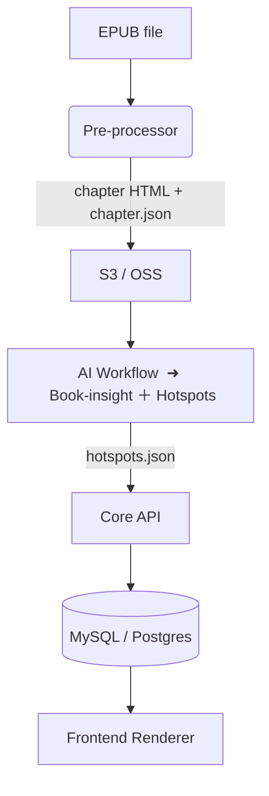

# 📑 Data Contract — Interactive Reading MVP

> **Scope:** Defines the artefacts, schemas and hand‑off points between the *Pre‑processor* (EPUB splitter), the **single** *AI Workflow* (book‑insight + hotspot generator) and the *Core API / DB*.
> **Audience:** Pre‑processing dev, Workflow team, Backend dev.
> **Status:** Draft v0.2 · 2025‑07‑27

---

## 0  Lifecycle & Versioning

| Field            | Value                                                                |
| ---------------- | -------------------------------------------------------------------- |
| `schema_version` | `0.2.0`                                                              |
| `last_updated`   | `2025‑07‑27`                                                         |
| **Change rule**  | MAJOR – breaking changes · MINOR – additive · PATCH – non‑functional |

---

## 1  High‑level Flow



---

## 2  Pre‑processor Output — `chapter.json`

Array of chapter objects; **one file per book**, stored beside chapter HTML.

| Field         | Type     | Req | Example               | Notes                 |
| ------------- | -------- | --- | --------------------- | --------------------- |
| `book_id`     | `uuid`   | ✔   | `4d5c…`               | Matches `books.id`    |
| `chapter_idx` | `int`    | ✔   | `1`                   | 0‑based               |
| `title`       | `string` | ✖   | `"Chapter 1"`         | Plain text            |
| `html_url`    | `string` | ✔   | `https://cdn…/1.html` | Public GET            |
| `cfi_start`   | `string` | ✔   | `epubcfi(/6/2…)`      | For hotspot targeting |
| `cfi_end`     | `string` | ✔   | …                     | —                     |
| `word_count`  | `int`    | ✖   | `1350`                | —                     |

> **Storage:** `s3://books/{book_id}/chapter.json`

---

## 3  AI Workflow Input

```jsonc
{
  "chapter_meta_url": "https://cdn…/chapter.json",
  "book_meta": {
    "book_id": "4d5c…",
    "title": "Dune",
    "author": "Frank Herbert"
  }
}
```

* Workflow fetches `chapter.json` and performs **(1) book‑insight discovery** via web search + LLM summarisation to build style / character context, then **(2) hotspot generation**.
* No separate `book_context.json` artefact is persisted; context lives inside workflow memory for the session.

---

## 4  AI Workflow Output — `hotspots.json`

Array, sorted by `chapter_idx` then appearance order.

| Field           | Type      | Req    | Example                         |        |
| --------------- | --------- | ------ | ------------------------------- | ------ |
| `hotspot_id`    | `uuid`    | ✔      | `3c2b…`                         |        |
| `chapter_idx`   | `int`     | ✔      | `1`                             |        |
| `cfi`           | `string`  | ✔      | `epubcfi(/6/4/2/12)`            |        |
| `text_excerpt`  | `string`  | ✔      | `"Arrakis — a planet of sand…"` |        |
| `image_url`     | `string`  | ✔      | `https://cdn…/3c2b.jpg`         |        |
| `audio_url`     | \`string  | null\` | ✖                               | `null` |
| `prompt_used`   | `json`    | ✖      | `{ "scene": "desert", …}`       |        |
| `created_at`    | `iso8601` | ✔      | `2025‑07‑27T08:15:33Z`          |        |
| `status`        | `enum`    | ✔      | `"success" \| "error"`          |        |
| `error_message` | \`string  | null\` | ✖                               | —      |

> **Delivery:** POST to `/api/hotspots` or upload to S3 then callback.

---

## 5  DB Mapping (MySQL 5.7+ example)

### `chapters`

```sql
CREATE TABLE chapters (
  id           BIGINT UNSIGNED PRIMARY KEY,
  book_id      BIGINT UNSIGNED NOT NULL,
  idx          INT NOT NULL,
  html_url     VARCHAR(512) NOT NULL,
  cfi_start    VARCHAR(64) NOT NULL,
  cfi_end      VARCHAR(64) NOT NULL,
  word_count   INT,
  UNIQUE KEY book_idx (book_id, idx)
);
```

### `hotspots`

```sql
CREATE TABLE hotspots (
  id            CHAR(36) PRIMARY KEY, -- UUID v4
  book_id       BIGINT UNSIGNED NOT NULL,
  chapter_idx   INT NOT NULL,
  cfi           VARCHAR(64) NOT NULL,
  text_excerpt  TEXT NOT NULL,
  image_url     VARCHAR(512) NOT NULL,
  audio_url     VARCHAR(512),
  prompt_json   JSON,
  status        ENUM('success','error') DEFAULT 'success',
  created_at    DATETIME DEFAULT CURRENT_TIMESTAMP
);
```

### `assets` *(optional)*

```sql
CREATE TABLE assets (
  id          CHAR(36) PRIMARY KEY,
  hotspot_id  CHAR(36) NOT NULL,
  type        ENUM('image','audio') NOT NULL,
  url         VARCHAR(512) NOT NULL,
  metadata    JSON,
  created_at  DATETIME DEFAULT CURRENT_TIMESTAMP
);
```

---

## 6  Error & Retry Policy

| Stage               | Detect           | Retry                   | Escalate             |
| ------------------- | ---------------- | ----------------------- | -------------------- |
| Upload chapter HTML | HTTP != 200      | 3× exponential back‑off | Flag `import_failed` |
| AI Workflow         | `status = error` | Manual re‑queue         | Slack alert          |

---

## 7  Glossary

| Term               | Meaning                                                                     |
| ------------------ | --------------------------------------------------------------------------- |
| **CFI**            | EPUB Canonical Fragment Identifier                                          |
| **Hotspot**        | Interactive dot binding a text range to rich media                          |
| **Style template** | Prompt scaffold auto‑derived by workflow to ensure book‑level art coherence |

---

*© ImaRead · Draft 0.2 — ready for team review*
