# 📑 Data Contract — Interactive Reading MVP

> **Scope:** Defines the artefacts, schemas and hand‑off points between the *Pre‑processor* (EPUB splitter), the **single** *AI Workflow* (book‑insight + hotspot generator) and the *Core API / DB*.
> **Audience:** Pre‑processing dev, Workflow team, Backend dev.
> **Status:** Draft v0.4 · 2025‑07‑29

---

## 0  Lifecycle & Versioning

| Field            | Value                                                   |
| ---------------- | ------------------------------------------------------- |
| `schema_version` | `0.3.0`                                                 |
| `last_updated`   | `2025‑07‑28`                                            |
| **Change rule**  | MAJOR – breaking · MINOR – additive · PATCH – docs/typo |

---

## 1  High‑level Flow

```mermaid
graph TD
  A[EPUB file] --> B(HTML Extractor)
  B -->|cleaned HTML| C[S3 / OSS]
  C --> D[AI Workflow  ➜  Book‑insight ＋ Hotspots]
  D -->|hotspots.json| E[Core API]
  E --> F[(PostgreSQL)]
  F --> G[Frontend Renderer]
```



---

## 2  HTML Extraction & Processing Pipeline

### 2.1 HTML Extractor

**Input:** EPUB file from `books.epub_url`

**Process:**
1. Extract raw HTML files from EPUB structure
2. Apply intelligent noise filtering:
   - Remove advertisement content
   - Filter copyright notices
   - Clean directory links and navigation elements
   - Preserve legitimate chapter titles (e.g., "Adjustments", "Addendum")
3. Generate dual-version output:
   - `raw_html/` - Original extracted content
   - `cleaned_html/` - Intelligently filtered content

**Configuration:** Uses `config.py` with customizable:
- `NOISE_TITLES` - Keywords for content filtering
- `NOISE_FILENAMES` - Patterns for file filtering
- Minimum text length thresholds
- Comment preservation settings


---


---

## 4  AI Workflow

### 4.1 Input

```jsonc
{
  "book_id": "4d5c90e2-f21c-4e9b-b3d0-024d3adca52f",
  "chapter_html_prefix": "https://cdn.imaread.com/books/4d5c90e2/{idx}.html",
  "book_meta": {
    "title": "Dune",
    "author": "Frank Herbert"
  }
}
```

Workflow internally performs:

1. Web‑search & LLM summarisation → create in‑memory style / character context.
2. For each chapter HTML file, pick hotspots → generate image/audio → upload to OSS.

### 4.2 Output — `hotspots.json`

Array, sorted by chapter.

| Field           | Type      | Req    | Notes                                       |                       |
| --------------- | --------- | ------ | ------------------------------------------- | --------------------- |
| `hotspot_id`    | `uuid`    | ✔      | Primary key                                 |                       |
| `chapter_idx`   | `int`     | ✔      | Matches `chapter_idx`                       |                       |
| `char_range`    | `int[2]`  | ✖      | `[start, end]` character offset             |                       |
| `text_excerpt`  | `string`  | ✔      | 0‑200 chars                                 |                       |
| `image_url`     | `string`  | ✔      | OSS URL                                     |                       |
| `audio_url`     | \`string  | null\` | ✖                                           | OSS URL or `null`     |
| `prompt_used`   | `json`    | ✖      | Prompt scaffold after variable substitution |                       |
| `created_at`    | `iso8601` | ✔      | —                                           |                       |
| `status`        | `enum`    | ✔      | `success` / `error`                         |                       |
| `error_message` | \`string  | null\` | ✖                                           | For failed generation |

> **Delivery:** POST JSON to `/api/workflow/hotspots` or put to S3 then callback.

---

## 5  DB Mapping (PostgreSQL example)

### `chapters`

```sql
CREATE TABLE chapters (
  id           BIGSERIAL PRIMARY KEY,
  book_id      BIGINT NOT NULL,
  idx          INT NOT NULL,
  html_url     VARCHAR(512) NOT NULL,
  word_count   INT,
  created_at   TIMESTAMP DEFAULT NOW(),
  UNIQUE (book_id, idx)
);
```

### `hotspots`

```sql
CREATE TABLE hotspots (
  id            CHAR(36) PRIMARY KEY,
  book_id       BIGINT NOT NULL,
  chapter_idx   INT NOT NULL,
  char_start    INT,
  char_end      INT,
  text_excerpt  TEXT NOT NULL,
  image_url     VARCHAR(512) NOT NULL,
  audio_url     VARCHAR(512),
  prompt_json   JSON,
  status        ENUM('success','error') DEFAULT 'success',
  created_at    TIMESTAMP DEFAULT CURRENT_TIMESTAMP
);
```

---

## 6  Error & Retry Policy

| Stage               | Detect           | Retry                   | Escalate             |
| ------------------- | ---------------- | ----------------------- | -------------------- |
| HTML Extraction     | Parse error      | 2× with different config | Flag `extraction_failed` |
| Upload chapter HTML | HTTP != 200      | 3× exponential back‑off | Flag `import_failed` |
| AI Workflow         | `status = error` | Manual re‑queue         | Slack alert          |

---

## 7  Glossary

| Term               | Meaning                                            |
| ------------------ | -------------------------------------------------- |
| **Char range**     | `[start,end]` — HTML character offset positioning |
| **Hotspot**        | Interactive dot binding a text range to rich media |
| **Style template** | Prompt scaffold auto‑derived per book              |

---

## 8  📋 Sample JSON Payloads


### 7.1 `hotspots.json`

```json
[
  {
    "hotspot_id": "d4ea77b2-1519-4b75-9f28-51a2e43ff7a6",
    "chapter_idx": 1,
    "char_range": [1250, 1320],
    "text_excerpt": "A dust cloud swirled beyond the shield wall…",
    "image_url": "https://cdn.imaread.com/books/4d5c90e2/images/ch1-spot1.jpg",
    "audio_url": null,
    "prompt_used": {
      "scene": "desert storm",
      "style": "retro‑sci‑fi, warm tones, cinematic"
    },
    "created_at": "2025-07-28T08:15:33Z",
    "status": "success"
  }
]
```

---

## 9  REST API Sketch

### 8.1 Run AI Workflow

```
POST /api/workflow/run
{
  "book_id": "4d5c90e2-f21c-4e9b-b3d0-024d3adca52f",
  "chapter_html_prefix": "https://cdn.imaread.com/books/4d5c90e2/{idx}.html",
  "book_meta": {
    "title": "Dune",
    "author": "Frank Herbert"
  }
}
→ 201 { "task_id": "a3f1…" }
```

### 8.2 Task Status

```
GET /api/workflow/status/{task_id}
→ 200 { "state": "processing", "progress": 42 }
```

### 8.3 Workflow Callback — Hotspots ingest

```
POST /api/workflow/hotspots
Authorization: Bearer {internal_token}
Body: hotspots.json (see 7.2)
→ 202 Accepted
```

### 8.4 Frontend Read APIs

* `GET /api/books/{book_id}/chapters/{chapter_idx}` → `{ chapter_meta, hotspots[] }`
* `POST /api/hotspots/{hotspot_id}/variations` → create user variation
* `GET /api/users/{user_id}/progress/{book_id}` / `PUT` same endpoint to update reading progress

> **Auth:** All user endpoints require JWT issued by Authing.

---

*© ImaRead · Draft 0.3 — ready for team review*
